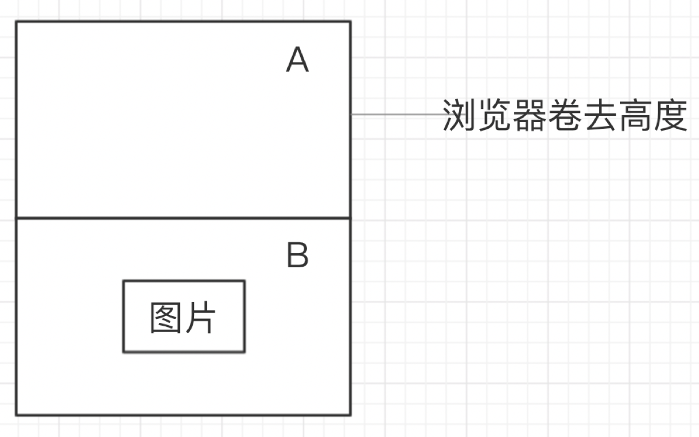

> 需求：我们在浏览有些网页的时候，当网页较长并且采用了瀑布流布局图片的时候，没有必要在页面加载的时候把图片全部加载出来。而是在我们往下浏览网页的时候，当页面滚动到相应位置才加载图片。
### 原理分析
假设页面长度为两个屏幕的大小，分为A区域和B区域，而待加载的图片在B区域。当浏览器卷去高度加上一屏幕的高度大于一屏幕的宽度加上图片底部距离A区域的距离（即卷去高度）时，加载真实图片。


### 实现
```javascript
window.onscroll = function () {
    let A = banner.offsetHeight + offset(banner).top; // 浏览器卷去高度加上一屏幕的高度
    let B = win("clientHeight") + win("scrollTop"); // 一屏幕的宽度加上图片底部距离A区域的距离(即卷去高度)
    if (A < B) {
        let oImg = new Image;
        oImg.src = imgFir.getAttribute("trueImg");
        oImg.onload = function () {
            imgFir.src = oImg.src;
            imgFir.style.display = "block";
            oImg = null;
        }
    }
};
```
> 上述使用的工具函数 win和offset在以前的笔记里面。01.png